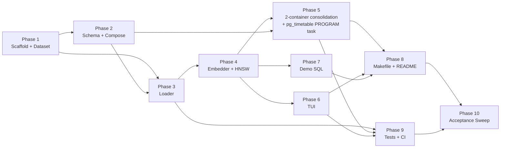

# Implementation Plan

This plan decomposes [spec-architecture-pgvector-beer-showcase.md](../spec/spec-architecture-pgvector-beer-showcase.md) into phases of atomic, independently verifiable tasks suitable for execution by AI agents. Each task lists the files it touches, the spec requirements it satisfies, and a machine-checkable completion criterion.

**Execution rules for agents:**

1. Execute phases in order; tasks within a phase MAY run in parallel unless a dependency is listed.
2. Do not start a task until all its dependencies are `DONE`.
3. After each task, run the stated verification. A task is `DONE` only when verification passes.
4. Never hardcode secrets; all credentials come from `.env` (SEC-001).
5. All SQL touching user input MUST be parameterized (SEC-003).
6. Keep code small and readable — the code itself is presentation material (GUD-002).

## Target Repository Layout

```
hops-n-vectors/
├── docker-compose.yml
├── .env                          # demo credentials (committed; demo-only)
├── Makefile
├── README.md
├── LICENSE
├── data/
│   └── beer_profile_and_ratings.csv    # bundled Kaggle snapshot (CC BY 4.0)
├── init/
│   ├── 01_schema.sql                   # extension, tables, dataset_meta
│   └── 02_timetable_job.sql            # rebuild_embeddings PROGRAM-task chain (idempotent)
├── app/                                # shared Python package (loader/embedder/tui)
│   ├── pyproject.toml
│   ├── Dockerfile                      # scheduler image: python:3.12-slim + pg_timetable binary
│   ├── entrypoint.sh                   # load → embed → exec pg_timetable
│   ├── hopsnvectors/
│   │   ├── __init__.py
│   │   ├── db.py                       # connection helper (env-driven)
│   │   ├── textcompose.py              # info-text composition + sha256 hash
│   │   ├── loader.py                   # CSV validation + upsert
│   │   ├── embedder.py                 # batch embedding + HNSW index
│   │   └── tui.py                      # interactive + --query/--json modes
│   └── tests/
│       ├── fixtures/mini_beers.csv     # ~20-row fixture
│       ├── test_textcompose.py
│       ├── test_loader.py
│       ├── test_tui_parsing.py
│       └── integration/
│           ├── test_upsert_idempotency.py
│           ├── test_vector_search.py
│           └── test_timetable_job.py
├── demo/
│   ├── 01_operators.sql
│   ├── 02_explain_no_index.sql
│   ├── 03_hnsw.sql
│   ├── 04_ivfflat.sql
│   ├── 05_filtering_pitfalls.sql
│   ├── 06_iterative_scan.sql
│   └── 07_similarity_limits.sql
└── .github/
    └── workflows/ci.yml
```

---

## Phase 1 — Repository Scaffold & Dataset

Goal: repo skeleton, bundled dataset, environment contract.

| Task | Status | Description | Files | Spec refs | Depends on |
|---|---|---|---|---|---|
| **1.1** | DONE | Create repo scaffold: directory tree above, `LICENSE`, `.gitignore` (Python, model caches), `.env` with `POSTGRES_USER/PASSWORD/DB=beer`, `EMBEDDING_MODEL`, `EMBED_BATCH_SIZE=64`, `REBUILD_SCHEDULE=*/15 * * * *`, `TOP_N_DEFAULT=5` | repo root, `.env` | §4.6, SEC-001 | — |
| **1.2** | DONE | Obtain the Kaggle "Beer Profile and Ratings Data Set" (ruthgn) CSV and commit it to `data/` as plain CSV (verify it is NOT a Git-LFS pointer). Record source URL, license, snapshot date in a `data/README.md` | `data/beer_profile_and_ratings.csv`, `data/README.md` | CON-002, CON-003, DAT-001 | — |
| **1.3** | DONE | Create ~20-row test fixture CSV sampled from the dataset, covering edge cases: duplicate natural key, empty description, non-ASCII name | `app/tests/fixtures/mini_beers.csv` | §6 Test Data | 1.2 |

**Phase gate:** `data/*.csv` parses with Python `csv` module and has expected columns; fixture ≤ 25 rows.

---

## Phase 2 — Database Schema & Compose Skeleton

Goal: `postgres` service boots with full schema; compose file validates.

| Task | Status | Description | Files | Spec refs | Depends on |
|---|---|---|---|---|---|
| **2.1** | DONE | Write `init/01_schema.sql`: `CREATE EXTENSION vector`, `beers` table exactly per §4.2 (identity PK, natural-key UNIQUE, `info`, `text_hash`, `embedding vector(384)`, `embedded_at`, `updated_at`), `dataset_meta` table, UTF-8 assumptions documented in comments. Do NOT create the HNSW index here (embedder owns it) | `init/01_schema.sql` | §4.2, REQ-002, REQ-013 | — |
| **2.2** | DONE | Write `docker-compose.yml` skeleton: `postgres` service on `pgvector/pgvector:pg18`, port mapped to `127.0.0.1:5432`, healthcheck (`pg_isready`), named volumes `pgdata` + `model-cache`, init dir mount, env from `.env` | `docker-compose.yml` | REQ-001, REQ-002, SEC-001, §4.1 | 1.1, 2.1 |
| **2.3** | DONE¹ | Add `scheduler` service (`cybertecpostgresql/pg_timetable:latest`) depending on `postgres` healthy; write idempotent `init/02_timetable_job.sql` establishing the Phase 2 placeholder for the `rebuild_embeddings` registration path, to be finalized in 5.4 with the schedule from `${REBUILD_SCHEDULE}` | `docker-compose.yml`, `init/02_timetable_job.sql` | REQ-010, §4.4, PLT-002 | 2.2 |

¹ Superseded by Phase 5: the stock pg_timetable image is replaced by a local build bundling the Python tools (spec v1.2, §4.1).

**Phase gate:** `docker compose config` passes; `docker compose up postgres` reaches healthy; `\d beers` shows the contract schema; `SELECT extversion FROM pg_extension WHERE extname='vector'` ≥ 0.7.0.

---

## Phase 3 — Python Package: Loader

Goal: validated, idempotent dataset load visible in compose logs.

| Task | Status | Description | Files | Spec refs | Depends on |
|---|---|---|---|---|---|
| **3.1** | DONE | Create `app/pyproject.toml` (deps: `psycopg[binary]`, `pgvector`, `sentence-transformers`, dev: `pytest`, `ruff`, `testcontainers`) and multi-arch `app/Dockerfile` on `python:3.12-slim` (CPU-only torch wheel; works on x86_64 + arm64) | `app/pyproject.toml`, `app/Dockerfile` | PLT-003, CON-004, CON-006, GUD-001 | 1.1 |
| **3.2** | DONE | Implement `hopsnvectors/db.py` (env-driven connection factory) and `hopsnvectors/textcompose.py`: compose `info` from name, style, description/notes, key taste attributes; `sha256(info)` as `text_hash`; handle empty/NULL fields (edge case 3) | `app/hopsnvectors/db.py`, `app/hopsnvectors/textcompose.py` | REQ-005, REQ-013 | 3.1 |
| **3.3** | DONE | Implement `hopsnvectors/loader.py`: validate CSV columns/format up-front (abort with clear error on failure — SEC-002, edge case 1); deduplicate on natural key with logged count (edge case 2); upsert via `INSERT ... ON CONFLICT (beer_name, brewery, style) DO UPDATE` setting `info`, `text_hash`, `updated_at` only when text changed; write `dataset_meta` rows (source URL, CC BY 4.0, snapshot version, load timestamp, row count); print human-readable progress (REQ-011); parameterized SQL only | `app/hopsnvectors/loader.py` | REQ-003, REQ-011, REQ-014, SEC-002, SEC-003, COM-001 | 3.2 |
| **3.4** | DONE | Unit tests: textcompose (composition, hashing, empty fields), loader validation (good file, missing column, LFS-pointer garbage, duplicates), UTF-8 names | `app/tests/test_textcompose.py`, `app/tests/test_loader.py` | §6 unit scope | 3.3, 1.3 |
| **3.5** | DONE¹ | Wire `loader` service into compose: local build, bind-mount `data/` read-only, `depends_on: postgres: condition: service_healthy`, run-to-completion (init-container pattern) | `docker-compose.yml` | PAT-001, §4.1 | 3.3, 2.2 |

¹ Superseded by Phase 5: the loader now runs as the first entrypoint stage of the `scheduler` container (spec v1.2, PAT-001).

**Phase gate (historical):** `pytest app/tests -k "not integration"` green; loader run exits 0, logs `loaded N beers (inserted=… updated=…)`; second run inserts 0 duplicates (AC-006 partial). (Originally verified via the standalone `loader` service; after Phase 5 the loader runs as the first `scheduler` entrypoint stage.)

---

## Phase 4 — Embedder & Vector Index

Goal: all rows embedded, HNSW index created, model cached in volume.

| Task | Status | Description | Files | Spec refs | Depends on |
|---|---|---|---|---|---|
| **4.1** | DONE | Implement `hopsnvectors/embedder.py`: load `all-MiniLM-L12-v2` via sentence-transformers with `HF_HOME` pointed at the `model-cache` volume; select pending rows `WHERE info <> '' AND (embedding IS NULL OR embedded_at IS NULL OR text_hash IS DISTINCT FROM sha256(info))` using `FOR UPDATE SKIP LOCKED` (edge case 7); embed in batches of `EMBED_BATCH_SIZE` with `executemany` updates setting `embedding`, `embedded_at` (PAT-003); print progress `embedding X/Y (Z%)` (REQ-011); resumable after interrupt (edge case 6); clear error message if Hugging Face unreachable on cold cache (edge case 10) | `app/hopsnvectors/embedder.py` | REQ-004, REQ-005, REQ-011, REQ-013, PAT-002, PAT-003, CON-001, CON-005 | 3.2 |
| **4.2** | DONE | After embedding pass, create HNSW index `beers_embedding_hnsw USING hnsw (embedding vector_cosine_ops)` idempotently (`IF NOT EXISTS`); log creation (IVFFlat is demo-script-only per REQ-006) | `app/hopsnvectors/embedder.py` | REQ-006, §4.2 | 4.1 |
| **4.3** | DONE¹ | Wire `embedder` service into compose: `depends_on: loader: condition: service_completed_successfully`, `model-cache` volume mounted, memory limit 2 GB; add post-completion log hint for TUI/psql commands (AC-001) | `docker-compose.yml` | PAT-001, PER-001, REQ-014, REQ-009 | 4.1, 3.5 |

¹ Superseded by Phase 5: the embedder now runs as the second entrypoint stage of the `scheduler` container; the memory limit and log hint move to the `scheduler` service (spec v1.2, PAT-001, PER-001).

**Phase gate:** full `docker compose up` completes; `SELECT count(*) FROM beers WHERE embedding IS NULL AND info <> ''` returns 0 (AC-003); HNSW index exists; restart without `-v` re-downloads nothing and is ready < 1 min (AC-006); initial embed < 5 min on 4-core CPU (PER-002/AC-009).

---

## Phase 5 — 2-Container Consolidation & Scheduled Re-embedding (pg_timetable PROGRAM task)

Goal: collapse the stack to two containers (`postgres` + `scheduler` with bundled Python tools); incremental rebuild job runs as a pg_timetable PROGRAM task reacting to data edits.

| Task | Status | Description | Files | Spec refs | Depends on |
|---|---|---|---|---|---|
| **5.1** | DONE | Add a re-embed entry point (e.g., `python -m hopsnvectors.embedder --once`) reusing 4.1 logic; safe for concurrent invocation (`FOR UPDATE SKIP LOCKED`) | `app/hopsnvectors/embedder.py` | REQ-010, PAT-002 | 4.1 |
| **5.2** | DONE | Extend `app/Dockerfile` into the scheduler image: multi-stage build copying the `pg_timetable` binary from `cybertecpostgresql/pg_timetable:latest` into `python:3.12-slim`; add `app/entrypoint.sh` running loader → embedder → TUI/psql log hint → `exec pg_timetable` (fail fast on non-zero stage exit) | `app/Dockerfile`, `app/entrypoint.sh` | §4.1, PAT-001, CON-006, REQ-009, REQ-011 | 5.1 |
| **5.3** | DONE | Rework compose to the 2-container topology: remove `loader`/`embedder`/`tui` services; single `scheduler` service (local build, `depends_on: postgres: condition: service_healthy`, `data/` bind-mounted read-only, `model-cache` volume, memory limit 2 GB); document TUI invocation `docker compose run --rm scheduler tui` | `docker-compose.yml` | §4.1, PAT-001, PER-001, REQ-001 | 5.2, 2.3, 3.5, 4.3 |
| **5.4** | DONE | Finalize `init/02_timetable_job.sql`: idempotent chain definition named `rebuild_embeddings` with a `kind => 'PROGRAM'` task invoking the embedder entry point from 5.1 inside the scheduler container; default `*/15 * * * *`, overridable via `${REBUILD_SCHEDULE}` | `init/02_timetable_job.sql` | REQ-010, §4.4, AC-010 | 5.1, 5.3 |

**Phase gate:** VERIFIED 2026-07-11 — `docker compose config` lists exactly two services; full `docker compose up` shows load → embed → pg_timetable start in the `scheduler` log stream (REQ-011); `SELECT * FROM timetable.chain;` shows `rebuild_embeddings` (AC-010); after `UPDATE beers SET info = info || ' extra hoppy' WHERE id = 1;` the next job run re-embeds only that row — verify via `embedded_at` (AC-005); `timetable.execution_log` shows ≥ 1 successful run.

---

## Phase 6 — TUI

Goal: interactive recommendations plus non-interactive CI mode.

| Task | Status | Description | Files | Spec refs | Depends on |
|---|---|---|---|---|---|
| **6.1** | DONE | Implement `hopsnvectors/tui.py` command parsing + REPL per §4.5: free text → prompt search; `:like <id>`, `:top <n>` (1–50), `:explain` toggle, `:help`, `:quit`/Ctrl-D. Validate prompts: reject empty or > 4,000 chars with friendly message (edge case 4); friendly "beer not found" for bad `:like` id (edge case 5); responsible-consumption banner on start (COM-003) | `app/hopsnvectors/tui.py` | REQ-007, REQ-008, §4.5, SEC-003, COM-003 | 3.2 |
| **6.2** | DONE | Implement search execution: embed prompt with cached model, run §4.3 query contracts (parameterized), display name/style/truncated info/distance; `:explain` prints `EXPLAIN ANALYZE` of the same query; default N from `TOP_N_DEFAULT` | `app/hopsnvectors/tui.py` | REQ-007, REQ-008, §4.3, PER-003 | 6.1, 4.1 |
| **6.3** | DONE | Add non-interactive mode `--query <text> --json [--top n]` emitting valid JSON (for CI/E2E) | `app/hopsnvectors/tui.py` | §6 E2E, §10 | 6.2 |
| **6.4** | DONE | Unit tests for command parsing and input validation (model mocked) | `app/tests/test_tui_parsing.py` | §6 unit scope | 6.1 |
| **6.5** | DONE | Add a `tui` shortcut to the `scheduler` image (e.g., console-script/argv dispatch in `entrypoint.sh`) so `docker compose run --rm scheduler tui` starts the TUI with model-cache mounted; no separate compose service | `app/entrypoint.sh`, `docker-compose.yml` | §4.1 | 6.2, 5.3 |

**Phase gate:** VERIFIED 2026-07-11 — `docker compose run --rm scheduler tui --query lemon --json` returns 5 results as valid JSON in < 2 s warm (AC-002, PER-003); interactive commands behave per §4.5.

---

## Phase 7 — Demo SQL Scripts

Goal: numbered, self-describing scripts for the live talk. Each script starts with a comment block explaining what it demonstrates and expected observations (GUD-003).

| Task | Status | Description | Files | Spec refs | Depends on |
|---|---|---|---|---|---|
| **7.1** | DONE | `01_operators.sql`: `<->`, `<#>`, `<=>`, `<+>` on sample vectors and real beers | `demo/01_operators.sql` | REQ-012 | Phase 4 |
| **7.2** | DONE | `02_explain_no_index.sql`: drop HNSW index, `EXPLAIN ANALYZE` showing seq scan + top-N heapsort | `demo/02_explain_no_index.sql` | REQ-012, AC-004 | Phase 4 |
| **7.3** | DONE | `03_hnsw.sql`: recreate HNSW, `EXPLAIN ANALYZE` showing index scan, lower latency | `demo/03_hnsw.sql` | REQ-012, AC-004 | 7.2 |
| **7.4** | DONE | `04_ivfflat.sql`: create IVFFlat (`lists` tuned for ~3,300 rows), compare plan/recall vs HNSW, drop afterwards | `demo/04_ivfflat.sql` | REQ-006, REQ-012 | 7.3 |
| **7.5** | DONE | `05_filtering_pitfalls.sql`: selective `WHERE` + ANN returning fewer rows than `LIMIT`; show the effect reproducibly | `demo/05_filtering_pitfalls.sql` | REQ-012, AC-008 | 7.3 |
| **7.6** | DONE | `06_iterative_scan.sql`: `SET hnsw.iterative_scan = relaxed_order` (and ivfflat equivalent) fixing 7.5's shortfall | `demo/06_iterative_scan.sql` | REQ-012, AC-008 | 7.5 |
| **7.7** | DONE | `07_similarity_limits.sql`: semantic adjacency pitfalls (e.g., "healthy" vs "unhealthy" style prompts) | `demo/07_similarity_limits.sql` | REQ-012 | Phase 4 |

**Phase gate:** VERIFIED 2026-07-11 — all scripts run without error in numbered order against a fresh stack (§10); `05` demonstrably returns fewer rows than `LIMIT` and `06` restores the full count (AC-008).

---

## Phase 8 — Developer UX: Makefile & README

| Task | Status | Description | Files | Spec refs | Depends on |
|---|---|---|---|---|---|
| **8.1** | DONE | `Makefile` targets: `up`, `tui`, `psql` (`docker compose exec postgres psql -U beer -d beer`), `demo` (runs numbered scripts), `reset` (`down -v` + up), `test`, `lint` | `Makefile` | GUD-004, REQ-009 | Phases 2–7 |
| **8.2** | DONE | `README.md`: quickstart (one command), presenter's script (recommended live-demo order incl. psql edit → watch pg_timetable re-embed), TUI/psql usage, dataset attribution (CC BY 4.0), model license (Apache 2.0), responsible-consumption disclaimer, offline behaviour & first-start network note, chunking as "real-life next step" talking point | `README.md` | GUD-005, COM-001..003, REQ-009 | Phases 2–7 |

**Phase gate:** VERIFIED 2026-07-11 — every documented command works verbatim on a clean checkout; README covers all §10 documentation checklist items. (Bonus: placeholder CI replaced with working lint + unit-test + compose-config workflow — first green Actions run; full pipeline remains Phase 9.)

---

## Phase 9 — Tests & CI

| Task | Description | Files | Spec refs | Depends on |
|---|---|---|---|---|
| **9.1** | Integration tests (testcontainers or compose fixtures, real pgvector image): schema bootstrap, upsert idempotency, vector-search ordering with precomputed vectors, pg_timetable registration + incremental re-embed | `app/tests/integration/*` | §6 integration scope | Phases 3–5 |
| **9.2** | E2E script: `docker compose up -d`, wait for ready, assert AC-001/AC-002/AC-003 via `docker compose run --rm scheduler tui --query lemon --json` and psql counts; record startup + embedding time, fail if over PER-002 budget | `.github/workflows/ci.yml` or `scripts/e2e.sh` | §6 E2E, PER-002 | Phases 4, 6 |
| **9.3** | GitHub Actions workflow: lint (ruff, shellcheck, hadolint) → unit → integration → e2e (nightly/manual); enforce ≥ 80 % coverage on loader/embedder/TUI | `.github/workflows/ci.yml` | §6 CI/CD, §10 | 9.1, 9.2 |

**Phase gate:** CI pipeline green end-to-end; coverage ≥ 80 %.

---

## Phase 10 — Final Acceptance Sweep

Verify every acceptance criterion on a clean machine (or clean Docker state):

| Check | Criterion |
|---|---|
| AC-001 | Clean `docker compose up` → ready < 10 min with visible progress + TUI/psql hints |
| AC-002 | TUI `lemon` → ≥ 5 citrus-ranked beers < 2 s |
| AC-003 | Embedded count = total row count |
| AC-004 | Seq-scan vs HNSW plans per demo scripts 02/03 |
| AC-005 | psql `info` edit → only that row re-embedded by scheduler |
| AC-006 | Restart without `-v`: no re-download, no duplicates, ready < 1 min |
| AC-007 | Fully offline start with warm caches succeeds |
| AC-008 | Filtering pitfall + iterative-scan fix demonstrable |
| AC-009 | CPU-only, initial embed < 5 min on 4-core laptop |
| AC-010 | `timetable.chain` lists `rebuild_embeddings` |

Also re-run the full §10 validation checklist (lint, tests, demo scripts, README contents, `SELECT count(*) ... embedding IS NULL` = 0).

---

## Dependency Graph (phase level)



## Risks & Mitigations

| Risk | Impact | Mitigation |
|---|---|---|
| CPU-only torch wheel size/arch issues on arm64 | Build failures on Apple Silicon | Pin CPU wheels per-arch in Dockerfile; test both arches early (Phase 3.1) |
| pg_timetable binary incompatible with `python:3.12-slim` base (glibc/arch) | Phase 5 image build fails | pg_timetable ships static-ish Go binaries and multi-arch images; verify `COPY --from` binary runs in the slim base early in 5.2, fall back to installing from release tarball |
| Kaggle CSV column names differ from schema assumptions | Loader rework | Task 1.2 lands the real CSV before loader code (Phase 3) is written |
| ANN filtering pitfall not reproducible on small dataset | AC-008 fails | Tune `ef_search`/filter selectivity in 7.5 until shortfall reproduces deterministically |
| Embedding exceeds 5-min budget on weak CI runners | Perf gate flaky | Batch size env-tunable; CI budget measured on defined runner class only |
